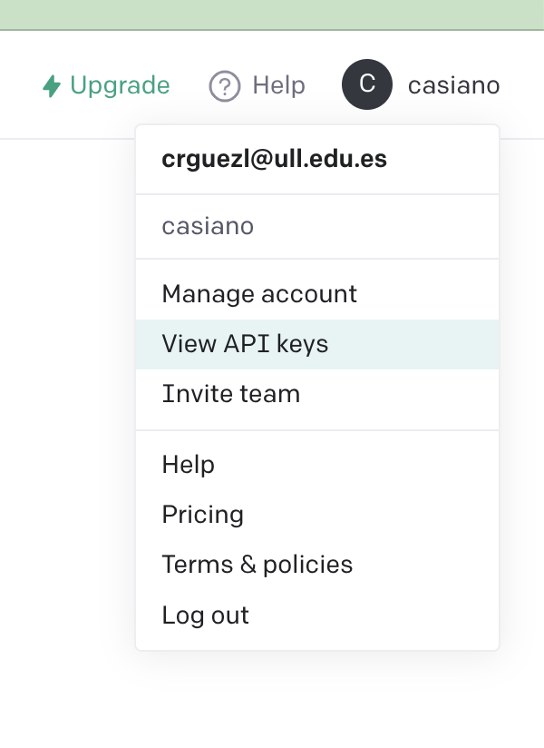
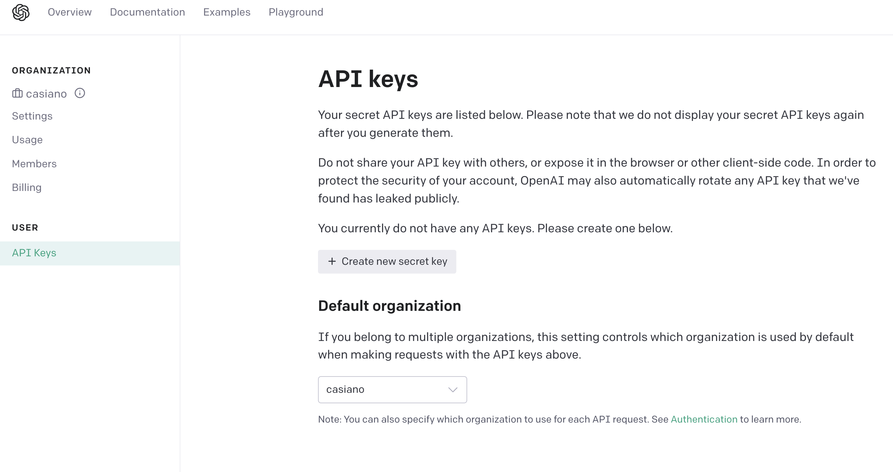
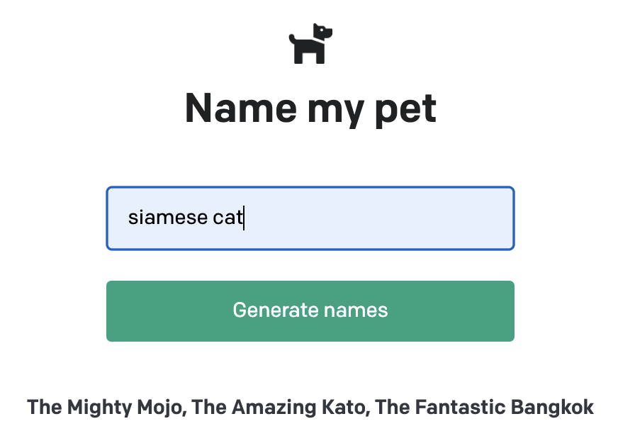

- [OpenAI API Quickstart - Node.js example app](#openai-api-quickstart---nodejs-example-app)
  - [Introduction](#introduction)
  - [Generating an API key](#generating-an-api-key)
  - [Setup](#setup)
  - [Rendering](#rendering)
  - [next.js Pages](#nextjs-pages)
    - [References](#references)
  - [pages/api/generate.js](#pagesapigeneratejs)
    - [`process.env.OPENAI_API_KEY`](#processenvopenai_api_key)
      - [References](#references-1)
    - [`export default async function (req, res) { ... }`](#export-default-async-function-req-res---)
    - [`const completion = await openai.createCompletion({ ... })`](#const-completion--await-openaicreatecompletion--)
  - [pages/index.js](#pagesindexjs)
    - [`import Head from "next/head"`](#import-head-from-nexthead)
    - [`import styles from "./index.module.css"`](#import-styles-from-indexmodulecss)
    - [`<link rel="icon" href="/dog.png" />`](#link-relicon-hrefdogpng-)
    - [`<main className={styles.main}>`](#main-classnamestylesmain)
    - [`<form onSubmit={onSubmit}> ...</form>`](#form-onsubmitonsubmit-form)
    - [`const response = await fetch("/api/generate", { ... })`](#const-response--await-fetchapigenerate---)
  - [State in React](#state-in-react)
  - [build](#build)
  - [Production](#production)

# OpenAI API Quickstart - Node.js example app

## Introduction

You can find the tutorial for this example app [here](https://beta.openai.com/docs/quickstart/build-your-application).

This is an example pet name generator app used in the OpenAI API [quickstart tutorial](https://beta.openai.com/docs/quickstart). It uses the [Next.js](https://nextjs.org/) framework with [React](https://reactjs.org/). Check out the tutorial or follow the instructions below to get set up.

## Generating an API key

Go to the user on the upper right corner and click on the API Keys tab. 


Choose View API Keys.



 Click on the "Create new secret Key" button and copy the key.

## Setup

1. If you don’t have Node.js installed, [install it from here](https://nodejs.org/en/)

2. Clone this repository

3. Navigate into the project directory

   ```bash
   $ cd openai-quickstart-node
   ```

4. Install the requirements

   ```bash
   $ npm install
   ```

   Which installs the dependencies listed in `package.json`:

   ```json
   ✗ jq -c '.dependencies | keys' package.json
   ["next","openai","react","react-dom"]
   ```

5. Make a copy of the example environment variables file

   ```bash
   $ cp .env.example .env
   ```

6. Add your [API key](https://beta.openai.com/account/api-keys) to the newly created `.env` file

7. Run the app

   ```bash
   $ npm run dev
   ```

   The console shows:

   ``` 
   ➜  openai-quickstart-node git:(master) ✗ npm run dev

   > openai-quickstart-node@0.1.0 dev
   > next dev

   ready - started server on 0.0.0.0:3000, url: http://localhost:3000
   info  - Loaded env from /Users/casianorodriguezleon/campus-virtual/2223/learning/openai-learning/openai-quickstart-node/.env
   wait  - compiling...
   event - compiled client and server successfully in 1174 ms (113 modules)
   ```

8. You should now be able to access the app at [http://localhost:3000](http://localhost:3000)! 

   


For the full context behind this example app, check out the [tutorial](https://beta.openai.com/docs/quickstart).

## Rendering

**Rendering** is the conversion of the code you write in your reactive framework (React/Vue/AngularJS) into the HTML representation of your User Interface. 
Rendering can take place 
1. on the server or 
2. on the client. 
   
It can happen either 

1. ahead of time at **build time**, or 
2. on every request at runtime.

With Next.js, three types of rendering methods are available:

1. Server-Side Rendering, 
   
   

   On the client, the HTML is used to show a fast non-interactive page, while React uses the JSON data and JavaScript instructions to make components interactive. This process is called **hydration**.
2. Static Site Generation, and 
3. Client-Side Rendering.
   
   

**Server-Side Rendering** and **Static Site Generation** are also referred to as **Pre-Rendering** 
because the fetching of external data and transformation of components into HTML happens **before** 
the result is sent to the client.


## next.js Pages

In Next.js, a page is a React Component exported from a .js, .jsx, .ts, or .tsx file in the `pages` directory. 

Each page is associated with a **route** based on its file name.

Since we have the file `pages/api/generate.js` that exports a React component, Next.js will make it accessible at the route `/api/generate`.

The `index.js` file is the main page `/` for the app. 

By default, Next.js includes its own server which is started with `next start`.

### References

See <https://nextjs.org/docs/basic-features/pages>

## pages/api/generate.js

See <https://www.npmjs.com/package/openai>. Check out the [full API documentation](https://beta.openai.com/docs/api-reference?lang=node.js) for examples of all the available functions in `openai`.


```js
import { Configuration, OpenAIApi } from "openai";

const configuration = new Configuration({
  apiKey: process.env.OPENAI_API_KEY,
});
const openai = new OpenAIApi(configuration);

export default async function (req, res) {
  const completion = await openai.createCompletion({
    model: "text-davinci-002",
    prompt: generatePrompt(req.body.animal),
    temperature: 0.6,
  });
  res.status(200).json({ result: completion.data.choices[0].text });
}

function generatePrompt(animal) {
  const capitalizedAnimal =
    animal[0].toUpperCase() + animal.slice(1).toLowerCase();
  return `Suggest three names for an animal that is a superhero.

Animal: Cat
Names: Captain Sharpclaw, Agent Fluffball, The Incredible Feline
Animal: Dog
Names: Ruff the Protector, Wonder Canine, Sir Barks-a-Lot
Animal: ${capitalizedAnimal}
Names:`;
}
```

### `process.env.OPENAI_API_KEY` 

Next.js allows you to set environment variables in 

1. `.env` (all environments), 
2. `.env.development` (development environment), and 
3. `.env.production` (production environment).
4. `.env.local` always overrides the defaults set.

The variables are accesible into `process.env`.

By default environment variables are only available in the Node.js environment, 
meaning they won't be exposed to the browser.

In order to expose a variable to the browser you have to prefix the variable with `NEXT_PUBLIC_`. 

When deploying your Next.js application to Vercel, Environment Variables can be configured in the [Project Settings](https://vercel.com/docs/concepts/projects/environment-variables?utm_source=next-site&utm_medium=docs&utm_campaign=next-website).

In Netlify you can use the Netlify UI. Head over to the Build & Deploy settings in your Site Settings, and then plug your values in under "Environment variables" or alternatively, use the [Netlify CLI](https://docs.netlify.com/cli/get-started/?_ga=2.210632407.351830897.1670331128-1485033729.1667990322#link-with-an-environment-variable)

#### References

* <https://nextjs.org/docs/basic-features/environment-variables>

### `export default async function (req, res) { ... }`

The **Server Request Object** (`req`) includes a set of 
Express.js-like helper methods to improve the developer experience and increase the speed of creating new API endpoints:

* `req.cookies` - An object containing the cookies sent by the request. Defaults to `{}`
* `req.query` - An object containing the query string. Defaults to `{}`
* `req.body` - An object containing the body parsed by content-type, or `null` if no body was sent

   See the code fragment `generatePrompt(req.body.animal)`

The **Server Response object**, ( abbreviated as `res`) includes a set of 
Express.js-like helper methods to improve the developer experience and increase the speed of creating new API endpoints:

* res.status(code) - A function to set the status code. code must be a valid HTTP status code
* res.json(body) - Sends a JSON response. body must be a serializable object
* res.send(body) - Sends the HTTP response. body can be a string, an object or a Buffer

   See the code fragment `res.status(200).json({ result: completion.data.choices[0].text });`
* res.redirect([status,] path) - Redirects to a specified path or URL. status must be a valid HTTP status code. If not specified, status defaults to "307" "Temporary redirect".
* res.revalidate(urlPath) - Revalidate a page on demand using getStaticProps. urlPath must be a string.

### `const completion = await openai.createCompletion({ ... })`

See the documentation at  <https://beta.openai.com/docs/api-reference/completions/create>

It makes a POST request to <https://api.openai.com/v1/completions>:

In the JSON body goes:

* `model`: `ID` of the model to use. You can use the List models API to see all of your available models
* `prompt`: string to generate completions for, encoded as a string, array of strings, array of tokens, or array of token arrays.
* `temperature`: Higher values means the model will take more risks. Try 0.9 for more creative applications, and 0  for ones with a well-defined answer.

The response is a JSON object with the following fields:

```json
{
  "id": "cmpl-uqkvlQyYK7bGYrRHQ0eXlWi7",
  "object": "text_completion",
  "created": 1589478378,
  "model": "text-davinci-003",
  "choices": [
    {
      "text": "\n\nThis is indeed a test",
      "index": 0,
      "logprobs": null,
      "finish_reason": "length"
    }
  ],
  "usage": {
    "prompt_tokens": 5,
    "completion_tokens": 7,
    "total_tokens": 12
  }
}
```

## pages/index.js

```js
import Head from "next/head";
import { useState } from "react";
import styles from "./index.module.css";

export default function Home() {
  const [animalInput, setAnimalInput] = useState("");
  const [result, setResult] = useState();

  async function onSubmit(event) {
    event.preventDefault();
    const response = await fetch("/api/generate", {
      method: "POST",
      headers: {
        "Content-Type": "application/json",
      },
      body: JSON.stringify({ animal: animalInput }),
    });
    const data = await response.json();
    setResult(data.result);
    setAnimalInput("");
  }
  return (
    <div>
      <Head>
        <title>OpenAI Quickstart</title>
        <link rel="icon" href="/dog.png" />
      </Head>

      <main className={styles.main}>
        
        <h3>Name my pet</h3>
        <form onSubmit={onSubmit}>
          <input
            type="text"
            name="animal"
            placeholder="Enter an animal"
            value={animalInput}
            onChange={(e) => setAnimalInput(e.target.value)}
          />
          <input type="submit" value="Generate names" />
        </form>
        <div className={styles.result}>{result}</div>
      </main>
    </div>
  );
}
```

### `import Head from "next/head"`

nextjs provides a built-in component for appending elements to the `head` of the page so that it can 
be used in the JSX of the page:

```jsx
<Head>
   <title>OpenAI Quickstart</title>
   <link rel="icon" href="/dog.png" />
</Head>
```

### `import styles from "./index.module.css"`

This is a [CSS module](https://nextjs.org/docs/basic-features/built-in-css-support#adding-component-level-css). 

Next.js supports CSS Modules using the `[name].module.css` file naming convention.

CSS Modules locally scope CSS by automatically creating a unique class name. 

This allows you to use the same CSS class name in different files without worrying about collisions.

###  `<link rel="icon" href="/dog.png" />`

This line in the `<Head>` component adds a favicon to the page. 
You'll find the image in the `public` directory.

Next.js can serve static files, like images, under a folder called `public` in the root directory.
Files inside `public` can then be referenced by your code starting from the base URL (`/`).

### `<main className={styles.main}>`

JSX lets you write HTML-like markup inside a JavaScript file, keeping rendering logic and content in the same place. 

Sometimes you will want to add a little JavaScript logic or reference a dynamic property inside that markup. 

In this situation, you can use curly braces in your JSX to open a window to JavaScript.

The only reason behind the fact that JSX uses `className` over `class` is that the `class` is a reserved keyword in JavaScript.

We are specifying that the `<main>` element should use the `main` class from the `index.module.css` file.

### `<form onSubmit={onSubmit}> ...</form>`

The `onSubmit` **prop** is a special React **prop** that lets you specify a function that will be called when the form is submitted.

The async function `onSubmit` is called when the form is submitted:

```js
  async function onSubmit(event) {
    event.preventDefault();
    const response = await fetch("/api/generate", {
      method: "POST",
      headers: {
        "Content-Type": "application/json",
      },
      body: JSON.stringify({ animal: animalInput }),
    });
    const data = await response.json();
    setResult(data.result);
    setAnimalInput("");
  }
```

### `const response = await fetch("/api/generate", { ... })`

The `fetch` function makes a request to the `/api/generate` endpoint of the nextjs server. 

Thus, the exported function in `pages/api/generate.js` is called and the JSON  returned at line

```js
  res.status(200).json({ result: completion.data.choices[0].text });
```

will be received in `data` after the second `await`:

```
const data = await response.json()
```

## State in React

**React states** are used to store data that can be changed over time.
In that sense, they are similar to variables declared with the `let` keyword.

The difference between a **React state** and a 
normal variable is that when a **React state variable** changes, 
the **component is rendered again** and some other things happens, like that 
the `useEffect` hook
bound to that state will be executed, 
but when a normal variable changes, this does not happen.
(The `useEffect` Hook allows us to perform side effects in our components.
It can be used to fetch data from an API, subscribe to a service, ...)

```js
import { useState } from "react";
// ...

export default function Home() {
  const [animalInput, setAnimalInput] = useState("");
  const [result, setResult] = useState();

  async function onSubmit(event) {
    // ...
    const data = await response.json();
    setResult(data.result);
    setAnimalInput("");
  }
  return (
    <div>
      <.../>
      <main className={styles.main}>
        <.../>
        <form onSubmit={onSubmit}>
          <input  type="text" name="animal" placeholder="Enter an animal"
            value={animalInput}
            onChange={(e) => setAnimalInput(e.target.value)}
          />
          <input type="submit" value="Generate names" />
        </form>
        <div className={styles.result}>{result}</div>
      </main>
    </div>
  );
}
```

In this code we have two states: `animalInput` and `result`.

Therefore, 

1. each time the `animalInput` state changes, the component is rendered again and the `useEffect` hook bound to that state will be executed.
2. each time the `result` state changes, the component is rendered again and the `useEffect` hook bound to that state will be executed.

The `useState` hook **allows us to create state variables for our components**. 

`useState` takes in an initial value as an argument and returns an array containing 

1. the **state** variable and 
2. a **setter** function to mutate it
 
It is common practice to de-structure this array and set its contents to be `const`. 
This is because 

* the state variable **should never be reassigned directly** and
* **should only be modified via the setter function**. 

The `setter` function accepts either a new value or a function which takes the current value as an argument and returns the new value like this:

```js
setResult(data.result); // data just arrived from the API
```

Since `data`has arrived from the API, we can set the `result` state to the value of `data.result`.
The `<div className={styles.result}>{result}</div>`has to be rendered again.

Th effect of this statement 

```js
setAnimalInput("");
```
is that the 
```jsx 
<input  type="text" name="animal" placeholder="Enter an animal"
            value={animalInput}
            onChange={(e) => setAnimalInput(e.target.value)}
/>
```

will be rendered again with an empty value.

The call to `setAnimalInput(e.target.value)` here:
   
```jsx
<input  type="text" name="animal" placeholder="Enter an animal"
   value={animalInput}
   onChange={(e) => setAnimalInput(e.target.value)}
/>
```

will be executed each time the user types a character in the `input` field.


## build

`next build` creates an optimized production build of your application. 
You can enable more verbose build output with the `--debug` flag in next build.

The output displays information about each route:


``` 
➜✗ npx next build --debug
info  - Loaded env from /Users/casianorodriguezleon/campus-virtual/2223/learning/openai-learning/openai-quickstart-node/.env
info  - Creating an optimized production build  
info  - Compiled successfully
info  - Collecting page data  
info  - Generating static pages (3/3)
info  - Finalizing page optimization  

Page                                       Size     First Load JS
┌ ○ /                                      998 B          73.8 kB
├   └ css/fc2c832f265f4111.css             522 B
├ ○ /404                                   193 B            73 kB
└ λ /api/generate                          0 B            72.8 kB
+ First Load JS shared by all              72.8 kB
  ├ chunks/framework-e70c6273bfe3f237.js   42 kB
  ├ chunks/main-f65e66e62fc5ca80.js        28.6 kB
  ├ chunks/pages/_app-02d0f4839caa4a8e.js  1.36 kB
  └ chunks/webpack-69bfa6990bb9e155.js     769 B

λ  (Server)  server-side renders at runtime (uses getInitialProps or getServerSideProps)
○  (Static)  automatically rendered as static HTML (uses no initial props)

Redirects

┌ source: /:path+/
├ destination: /:path+
└ permanent: true
```

This generates the site in the `.next` directory.

## Production

`next start` starts the application in *production* mode. 
The application should be compiled with `next build` before starting.

```
npx next start -p 4000

ready - started server on 0.0.0.0:4000, url: http://localhost:4000
info  - Loaded env from /Users/casianorodriguezleon/campus-virtual/2223/learning/openai-learning/openai-quickstart-node/.env
```

