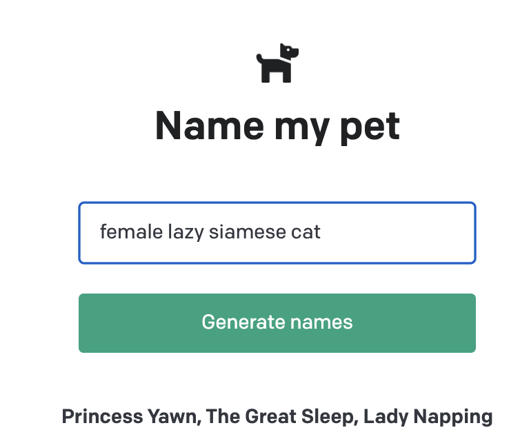

# OpenAI API Quickstart - Node.js example app

## Introduction

You can find the tutorial for this example app [here](https://beta.openai.com/docs/quickstart/build-your-application).

This is an example pet name generator app used in the OpenAI API [quickstart tutorial](https://beta.openai.com/docs/quickstart). It uses the [Next.js](https://nextjs.org/) framework with [React](https://reactjs.org/). Check out the tutorial or follow the instructions below to get set up.

## Generating an API key

Go to the user on the upper right corner and click on the API Keys tab. 


Choose View API Keys.


 Click on the "Create new secret Key" button and copy the key.

## Setup

1. If you don’t have Node.js installed, [install it from here](https://nodejs.org/en/)

2. Clone this repository

3. Navigate into the project directory

   ```bash
   $ cd openai-quickstart-node
   ```

4. Install the requirements

   ```bash
   $ npm install
   ```

5. Make a copy of the example environment variables file

   ```bash
   $ cp .env.example .env
   ```

6. Add your [API key](https://beta.openai.com/account/api-keys) to the newly created `.env` file

7. Run the app

   ```bash
   $ npm run dev
   ```

The consolo shows:

``` 
➜  openai-quickstart-node git:(master) ✗ npm run dev

> openai-quickstart-node@0.1.0 dev
> next dev

ready - started server on 0.0.0.0:3000, url: http://localhost:3000
info  - Loaded env from /Users/casianorodriguezleon/campus-virtual/2223/learning/openai-learning/openai-quickstart-node/.env
wait  - compiling...
event - compiled client and server successfully in 1174 ms (113 modules)
```

You should now be able to access the app at [http://localhost:3000](http://localhost:3000)! 



For the full context behind this example app, check out the [tutorial](https://beta.openai.com/docs/quickstart).
